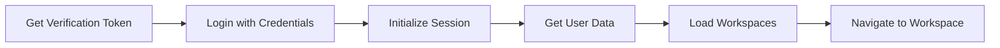

# XSC Ivanti Mobile App - Architecture Overview

## 🏗️ Project Structure

This project follows **Clean Architecture** principles with **MVVM** pattern for the presentation layer.

```
xsc-ivanti-mobile-app/
├── docs/
│   ├── copilot-instructions.md       # Comprehensive development guidelines
│   └── LoginPageImplementation.md    # Implementation documentation
│
├── src/
│   ├── Domain/                        # Core business entities (innermost layer)
│   │   └── [Currently minimal - will expand as needed]
│   │
│   ├── Application/                   # Business logic & contracts
│   │   ├── Common/                    # Shared utilities (Result, PagedResult)
│   │   ├── DTOs/                      # Data Transfer Objects
│   │   ├── Exceptions/                # Application exceptions
│   │   ├── Interfaces/                # ⭐ Service contracts
│   │   │   ├── Authentication/        # IAuthenticationService
│   │   │   ├── Navigation/            # INavigationService
│   │   │   └── Workspaces/            # IWorkspaceService
│   │   ├── Models/                    # Application models
│   │   │   ├── Login/                 # Authentication models
│   │   │   ├── UserData/
│   │   │   ├── RoleWorkspaces/
│   │   │   └── [Other models]
│   │   ├── Requests/                  # API request DTOs
│   │   ├── Responses/                 # API response DTOs
│   │   └── Services/                  # IIvantiClient (low-level client interface)
│   │
│   ├── Infrastructure/                # External concerns & implementations
│   │   ├── Authentication/            # ⭐ AuthenticationService
│   │   ├── Workspaces/                # ⭐ WorkspaceService
│   │   ├── Ivanti/                    # Ivanti API client
│   │   │   ├── Configuration/         # IvantiOptions
│   │   │   ├── IvantiClient.cs        # Low-level HTTP client
│   │   │   └── IvantiEndpoints.cs     # API endpoints
│   │   ├── Mapping/                   # Mapster configuration
│   │   └── DependencyInjection.cs     # Service registration
│   │
│   └── WebUI/                         # Blazor Server UI
│       ├── Features/                  # ⭐ Feature-organized pages (MVVM)
│       │   ├── Login/
│       │   │   ├── ViewModels/
│       │   │   │   ├── LoginViewModel.cs
│       │   │   │   └── SelectRoleViewModel.cs
│       │   │   ├── Login.razor        # UI markup
│       │   │   ├── Login.razor.cs     # Code-behind (minimal)
│       │   │   ├── SelectRole.razor
│       │   │   └── SelectRole.razor.cs
│       │   └── Incidents/
│       │       ├── ViewModels/
│       │       │   └── IncidentsViewModel.cs
│       │       └── [Incident pages]
│       ├── Services/                  # ⭐ NavigationService
│       └── Program.cs
│
└── tests/                             # [Future] Unit & Integration tests
```

## 🎯 Key Design Patterns

### 1. Clean Architecture
- **Domain** → Core entities (no dependencies)
- **Application** → Business logic & interfaces (depends on Domain only)
- **Infrastructure** → Implementations (depends on Application)
- **WebUI** → Presentation (depends on Application for contracts)

### 2. MVVM Pattern
Every page consists of:
- **`.razor`** - UI markup (View)
- **`.razor.cs`** - Minimal code-behind (View)
- **`ViewModel.cs`** - All business logic (ViewModel)

### 3. Service Layer
- **Interfaces** defined in `Application/Interfaces/`
- **Implementations** in `Infrastructure/`
- **Dependency Injection** for loose coupling

## 🔐 Authentication Flow



### Steps:
1. **Get Verification Token** - Extract CSRF token from login page
2. **Login** - POST credentials with token
3. **Initialize Session** - Get session data from Ivanti
4. **Get User Data** - Retrieve user information
5. **Load Workspaces** - Get available workspaces for user's role
6. **Navigate** - Redirect to first workspace (typically Incidents)

## 📦 Key Services

### IAuthenticationService
```csharp
Task<Result<VerificationToken>> GetVerificationTokenAsync()
Task<Result<AuthenticationResult>> LoginAsync(username, password, token)
Task<Result> LogoutAsync()
bool IsAuthenticated { get; }
```

### IWorkspaceService
```csharp
Task<Result<RoleWorkspaces>> GetRoleWorkspacesAsync()
Task<Result<WorkspaceData>> GetWorkspaceDataAsync()
Task<Result<FormViewData>> FindFormViewDataAsync(...)
Task<Result<FormDefaultData>> GetFormDefaultDataAsync(...)
```

### INavigationService
```csharp
void NavigateToLogin()
void NavigateToSelectRole()
void NavigateToFirstWorkspace()
void NavigateToWorkspace(workspaceName)
```

## 🛠️ Technology Stack

- **.NET 10.0** - Framework
- **C# 14.0** - Language
- **Blazor Server** - UI Framework
- **MudBlazor 9.2.0** - UI Component Library
- **Mapster 7.4.0** - Object Mapping
- **Serilog** - Logging

## 🚀 Getting Started

### Prerequisites
- .NET 10 SDK
- Visual Studio 2026 or VS Code
- Access to Ivanti ServiceDesk instance

### Configuration
Update `appsettings.json`:
```json
{
  "Ivanti": {
    "BaseUrl": "https://your-instance.ivanti.com",
    "ApiKey": "your-api-key",
    "Cookie": "initial-cookie-if-needed"
  }
}
```

### Run the Application
```bash
cd src/WebUI
dotnet run
```

Navigate to: `https://localhost:5001/login`

## 📝 Development Guidelines

### Creating a New Page

1. **Create ViewModel** (`Features/<Feature>/ViewModels/<Page>ViewModel.cs`)
   ```csharp
   public class MyPageViewModel
   {
       private readonly IMyService _service;
       public bool IsLoading { get; private set; }
       public async Task InitializeAsync() { }
   }
   ```

2. **Create Razor View** (`Features/<Feature>/MyPage.razor`)
   ```razor
   @page "/my-page"
   <!-- MudBlazor UI components -->
   ```

3. **Create Code-Behind** (`Features/<Feature>/MyPage.razor.cs`)
   ```csharp
   public partial class MyPage : ComponentBase
   {
       [Inject] private MyPageViewModel ViewModel { get; set; } = default!;
       protected override async Task OnInitializedAsync()
       {
           await ViewModel.InitializeAsync();
       }
   }
   ```

4. **Register ViewModel** (in `Program.cs`)
   ```csharp
   builder.Services.AddScoped<MyPageViewModel>();
   ```

### Creating a New Service

1. **Define Interface** (`Application/Interfaces/<Category>/IMyService.cs`)
2. **Implement Service** (`Infrastructure/<Category>/MyService.cs`)
3. **Register Service** (`Infrastructure/DependencyInjection.cs`)

## ❌ Common Mistakes to Avoid

- ❌ Putting business logic in `.razor` or `.razor.cs` files
- ❌ Referencing Infrastructure from Application layer
- ❌ Creating services without interfaces
- ❌ Not using Result<T> for error handling
- ❌ Mixing concerns across layers

## ✅ Best Practices

- ✅ Follow Clean Architecture boundaries
- ✅ Use MVVM for all pages
- ✅ Implement interfaces in Application layer
- ✅ Use Result<T> for error handling
- ✅ Log all important operations
- ✅ Write XML documentation
- ✅ Use MudBlazor components consistently

## 📚 Documentation

- [Copilot Instructions](docs/copilot-instructions.md) - Comprehensive guidelines
- [Login Implementation](docs/LoginPageImplementation.md) - Authentication details

## 🤝 Contributing

Follow the patterns and conventions outlined in `docs/copilot-instructions.md`.

## 📄 License

[Add your license information here]

---

**Questions?** Refer to `docs/copilot-instructions.md` for detailed guidance. 🚀
