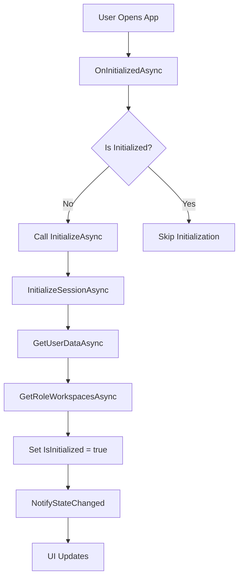

# Dynamic Navigation Implementation with Ivanti API

## Overview

This implementation creates a dynamic navigation menu in Blazor using MudBlazor components that integrates with the Ivanti API to:
- Initialize user sessions automatically
- Display user information in the AppBar
- Dynamically generate navigation menu items based on user's available workspaces
- Provide sign-in/sign-out functionality

## Architecture

### Components Created/Modified

#### 1. **IvantiNavigationService** (`src/WebUI/Services/IvantiNavigationService.cs`)

A scoped service that manages the Ivanti session lifecycle:

**Responsibilities:**
- Initializes session by calling `IIvantiClient` methods in sequence:
  1. `InitializeSessionAsync()` - Establishes session with Ivanti API
  2. `GetUserDataAsync()` - Retrieves user profile information  
  3. `GetRoleWorkspacesAsync()` - Gets available workspaces for the user

**Key Features:**
- State management with `OnStateChanged` event for reactive UI updates
- Loading and error state tracking
- User helper methods (`GetUserInitials()`, `GetUserDisplayName()`)
- Sign-out functionality

**Usage:**
```csharp
@inject IvantiNavigationService NavigationService

protected override async Task OnInitializedAsync()
{
    await NavigationService.InitializeAsync();
}
```

#### 2. **NavMenu.razor** (`src/WebUI/Components/Layout/NavMenu.razor`)

Dynamic navigation menu that renders workspace links:

**Features:**
- Displays loading indicator during initialization
- Shows error messages if initialization fails
- Dynamically generates `MudNavLink` items from workspace data
- Icon mapping based on workspace names
- URL mapping for workspace navigation

**Icon Mapping Logic:**
```csharp
private string GetWorkspaceIcon(string workspaceName)
{
    return workspaceName.ToLower() switch
    {
        var name when name.Contains("incident") => Icons.Material.Filled.Add,
        var name when name.Contains("service") => Icons.Material.Filled.MiscellaneousServices,
        var name when name.Contains("problem") => Icons.Material.Filled.ReportProblem,
        var name when name.Contains("change") => Icons.Material.Filled.ChangeHistory,
        _ => Icons.Material.Filled.WorkOutline
    };
}
```

#### 3. **MobileLayout.razor** (`src/WebUI/Components/Layout/MobileLayout.razor`)

Mobile-optimized layout with:

**AppBar Features:**
- User initials chip (MudChip)
- User menu (MudMenu) with:
  - User display name and email
  - Profile link
  - Settings link
  - Sign out button
- Loading indicator during session initialization
- Sign in button when not authenticated

**Drawer:**
- Temporary drawer (slides in on menu button click)
- Contains dynamic NavMenu

#### 4. **TabletLayout.razor** (`src/WebUI/Components/Layout/TabletLayout.razor`)

Tablet/desktop-optimized layout with:

**AppBar Features:**
- Same user interface as mobile
- Responsive design

**Drawer:**
- Responsive drawer (automatically shows/hides based on screen size)
- Breakpoint at `Breakpoint.Md`
- ClipMode set to `DrawerClipMode.Always` for better UX

## MudBlazor Components Used

### Core Components

| Component | Purpose |
|-----------|---------|
| `MudAppBar` | Top navigation bar with branding and user menu |
| `MudDrawer` | Side navigation panel |
| `MudNavMenu` | Container for navigation links |
| `MudNavLink` | Individual navigation items |
| `MudChip` | User initials display |
| `MudMenu` | Dropdown menu for user actions |
| `MudMenuItem` | Individual menu options |
| `MudProgressCircular` | Loading indicator |
| `MudAlert` | Error message display |
| `MudDivider` | Visual separator in menus |
| `MudSpacer` | Flexible spacing in AppBar |

### MudChip Usage

**Important:** MudChip is a generic component requiring a type parameter:

```razor
<MudChip T="string" 
         Color="Color.Surface" 
         Size="Size.Small">
    @NavigationService.GetUserInitials()
</MudChip>
```

### MudMenu Configuration

**Best Practice for AppBar Menus:**

```razor
<MudMenu Icon="@Icons.Material.Filled.AccountCircle" 
         Color="Color.Inherit"
         AnchorOrigin="Origin.BottomRight"
         TransformOrigin="Origin.TopRight"
         Dense="true">
    <!-- Menu items -->
</MudMenu>
```

**Key Parameters:**
- `AnchorOrigin="Origin.BottomRight"` - Menu appears from bottom-right of button
- `TransformOrigin="Origin.TopRight"` - Menu expands from top-right corner
- `Dense="true"` - Compact menu items

### MudDrawer Variants

**Mobile (Temporary):**
```razor
<MudDrawer @bind-Open="_drawerOpen"
           Variant="DrawerVariant.Temporary"
           Elevation="2">
```
- Overlays content
- Closes when clicking outside
- Ideal for small screens

**Tablet/Desktop (Responsive):**
```razor
<MudDrawer @bind-Open="_drawerOpen"
           Variant="DrawerVariant.Responsive"
           Breakpoint="Breakpoint.Md"
           ClipMode="DrawerClipMode.Always">
```
- Automatically shows on larger screens
- Hides on smaller screens
- ClipMode ensures content flows properly

## Service Registration

**Program.cs:**

```csharp
// Register Navigation Service
builder.Services.AddScoped<IvantiNavigationService>();
```

**Lifetime:** `Scoped` - One instance per user session/circuit

## State Management

The service uses the **event-driven pattern** for state changes:

```csharp
public event Action? OnStateChanged;

private void NotifyStateChanged() => OnStateChanged?.Invoke();
```

**Components subscribe:**
```csharp
protected override void OnInitialized()
{
    NavigationService.OnStateChanged += StateHasChanged;
}

public void Dispose()
{
    NavigationService.OnStateChanged -= StateHasChanged;
}
```

## Error Handling

Three-state system:

1. **Loading State** (`IsLoading = true`)
   - Shows `MudProgressCircular`

2. **Error State** (`ErrorMessage != null`)
   - Shows `MudAlert` with error message

3. **Success State** (`IsInitialized = true`)
   - Shows user menu and workspace navigation

## API Call Sequence



## Customization Guide

### Adding New Workspace Icons

Edit `GetWorkspaceIcon()` in NavMenu.razor:

```csharp
var name when name.Contains("custom") => Icons.Material.Filled.YourIcon,
```

### Adding New Menu Items

Add to MudMenu in layout files:

```razor
<MudMenuItem Icon="@Icons.Material.Filled.YourIcon">
    Your Menu Item
</MudMenuItem>
```

### Changing AppBar Color

Update MudAppBar:

```razor
<MudAppBar Color="Color.Secondary">
```

### Customizing User Display

Modify `IvantiNavigationService`:

```csharp
public string GetUserInitials()
{
    // Your custom logic
}
```

## Performance Considerations

1. **Scoped Lifetime**: Service instance per user prevents memory leaks
2. **Lazy Initialization**: Only loads data when needed
3. **Event Unsubscription**: Prevents memory leaks via IDisposable
4. **Conditional Rendering**: Only renders when data is available

## Security Considerations

1. Session tokens managed by `IIvantiClient`
2. Sign-out clears all user data
3. No sensitive data cached in browser storage
4. CSRF tokens handled by Ivanti API

## Testing

### Manual Testing Checklist

- [ ] App initializes and loads workspaces
- [ ] User initials display correctly
- [ ] User menu shows user information
- [ ] Sign out clears session
- [ ] Error states display properly
- [ ] Loading indicators show during API calls
- [ ] Navigation links work correctly
- [ ] Mobile drawer opens/closes
- [ ] Responsive drawer behavior on resize

## Troubleshooting

### Workspaces Not Loading

**Check:**
1. IvantiClient is registered in DI
2. API endpoints are correct
3. Network connectivity
4. CSRF token validity

**Debug:**
```csharp
_logger.LogInformation("Loaded {Count} workspaces", RoleWorkspaces.Workspaces.Count);
```

### User Menu Not Displaying

**Verify:**
1. `NavigationService.IsInitialized` is true
2. `NavigationService.UserData` is not null
3. Component subscribed to `OnStateChanged`

### Build Errors

**Common Issues:**
- Missing `@using WebUI.Services` in _Imports.razor
- MudChip without type parameter: Use `<MudChip T="string">`
- Missing service registration in Program.cs

## Future Enhancements

Potential improvements:

1. **Persistence**: Save last selected workspace
2. **Caching**: Cache workspace data
3. **Profile Pictures**: Add avatar images
4. **Notifications**: Badge for new items
5. **Search**: Workspace/item search
6. **Recent Items**: Quick access to recent workspaces
7. **Favorites**: Pin favorite workspaces

## References

- [MudBlazor Documentation](https://mudblazor.com/)
- [Blazor Dependency Injection](https://learn.microsoft.com/aspnet/core/blazor/fundamentals/dependency-injection)
- [Blazor State Management](https://learn.microsoft.com/aspnet/core/blazor/state-management)

---

**Last Updated:** 2025  
**Version:** 1.0  
**Framework:** .NET 10, Blazor Server, MudBlazor v9.2.0
