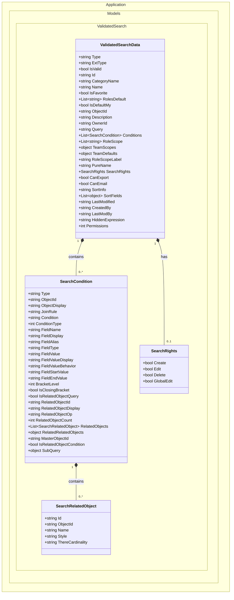

# ValidatedSearch Class Diagram

## Mermaid Class Diagram



## JSON Structure Mapping

```
8.ValidatedSearch.json
{
  "d": {                           ← ValidatedSearchData
    "Name": "...",
    "Conditions": [                ← List<SearchCondition>
      {
        "FieldName": "Status",
        "RelatedObjects": [         ← List<SearchRelatedObject>
          {
            "ID": "Incident#",
            "Name": "Incident",
            "Style": "master"
          }
        ]
      }
    ],
    "SearchRights": {              ← SearchRights
      "Create": false,
      "Edit": false
    }
  }
}
```

## Property to JSON Mapping

### ValidatedSearchData

| C# Property | JSON Property | Type | Notes |
|-------------|---------------|------|-------|
| `Type` | `__type` | string | Metadata type identifier |
| `ExtType` | `ExtType` | string | Always "search-save" for saved searches |
| `IsFavorite` | `isFavorite` | bool | Note: lowercase 'i' in JSON |
| `IsDefaultMy` | `isDefaultMy` | bool | Note: lowercase 'i' in JSON |
| `RoleScopeLabel` | `RoleScopelabel` | string | Note: lowercase 'l' in JSON |
| `PureName` | `pureName` | string | Note: lowercase 'p' in JSON |
| `Query` | `Query` | string | **Serialized JSON string**, not object |
| `LastModified` | `LastModified` | string | Microsoft JSON date format |

### SearchCondition

| C# Property | JSON Property | Type | Notes |
|-------------|---------------|------|-------|
| `Type` | `__type` | string | Usually "MetaDataDefinition.Revisions.R1.SearchCondition" |
| `JoinRule` | `JoinRule` | string | "AND" or "OR" |
| `Condition` | `Condition` | string | "=", "!=", ">", "<", "()", etc. |
| `ConditionType` | `ConditionType` | int | 0 = ByField, 1 = ByRelatedObject |
| `FieldValueBehavior` | `FieldValueBehavior` | string | "single" or "list" |
| `RelatedObjects` | `RelatedObjects` | array | All available relationships |

### SearchRelatedObject

| C# Property | JSON Property | Type | Notes |
|-------------|---------------|------|-------|
| `Id` | `ID` | string | Note: uppercase 'ID' in JSON |
| `Style` | `Style` | string | "master" or "related" |
| `ThereCardinality` | `ThereCardinality` | string | "One", "Many", or "" (empty) |

## Usage Patterns

### Pattern 1: Display Saved Search

```csharp
public string GetSearchSummary(ValidatedSearchData search)
{
    var conditionSummary = search.Conditions
        .Select(c => $"{c.FieldDisplay} {c.Condition} {c.FieldValueDisplay}")
        .Aggregate((a, b) => $"{a} {b}");

    return $"{search.Name}: {conditionSummary}";
}

// Example output: "My Team's Active Incidents: Status = Active AND Team in $(CurrentUserTeamNames())"
```

### Pattern 2: Build Query from Conditions

```csharp
public Expression<Func<Incident, bool>> BuildPredicate(List<SearchCondition> conditions)
{
    Expression<Func<Incident, bool>> predicate = i => true;

    foreach (var condition in conditions)
    {
        var fieldPredicate = BuildFieldPredicate(condition);

        predicate = condition.JoinRule?.ToUpper() == "OR"
            ? predicate.Or(fieldPredicate)
            : predicate.And(fieldPredicate);
    }

    return predicate;
}
```

### Pattern 3: Related Object Navigation

```csharp
public List<SearchRelatedObject> GetAvailableRelationships(SearchCondition condition)
{
    return condition.RelatedObjects
        .Where(ro => ro.Style == "related")
        .OrderBy(ro => ro.Name)
        .ToList();
}

// Group by cardinality
public Dictionary<string, List<SearchRelatedObject>> GroupByCardinality(SearchCondition condition)
{
    return condition.RelatedObjects
        .Where(ro => ro.Style == "related")
        .GroupBy(ro => ro.ThereCardinality ?? "One")
        .ToDictionary(g => g.Key, g => g.ToList());
}
```

## Validation

### Check Search Validity

```csharp
public bool IsSearchValid(ValidatedSearchData search)
{
    if (!search.IsValid)
        return false;

    if (search.Conditions == null || !search.Conditions.Any())
        return false;

    // Check all conditions have required fields
    return search.Conditions.All(c =>
        !string.IsNullOrEmpty(c.FieldName) &&
        !string.IsNullOrEmpty(c.Condition)
    );
}
```

### Validate User Permissions

```csharp
public bool CanUserAccessSearch(ValidatedSearchData search, string userRole)
{
    // Check if user's role is in scope
    if (search.RoleScope?.Contains(userRole) != true)
        return false;

    // Check permissions
    return search.Permissions > 0;
}
```

## Integration Points

### 1. Search Dropdown
Shows available saved searches to users

### 2. Quick Filter
Applies conditions to data grid

### 3. Advanced Search Builder
Allows creating/editing search conditions

### 4. Export Functionality
Exports filtered results when `CanExport = true`

### 5. Notification/Email
Sends results when `CanEmail = true`

## Cardinality Reference

| Notation | Meaning |
|----------|---------|
| `0...1` | Zero or One |
| `0...N` | Zero to Many |
| `0...M` | Zero to Many (bidirectional) |
| `1` | Exactly One |
| `N` | Many |
| `""` (empty) | Master/Self reference |

---

**Generated From:** `8.ValidatedSearch.json`
**Namespace:** `Application.Models.ValidatedSearch`
**Framework:** .NET 10
**Date:** 2025
