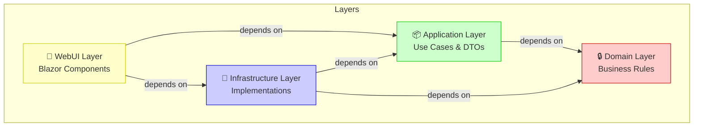
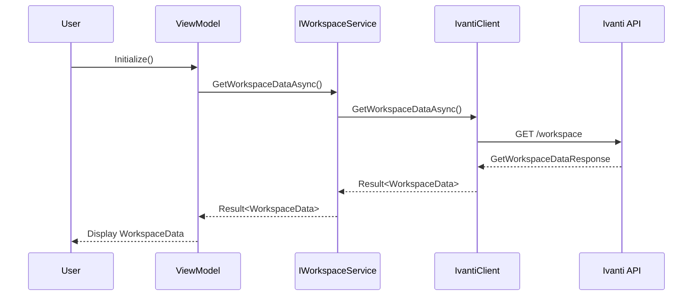
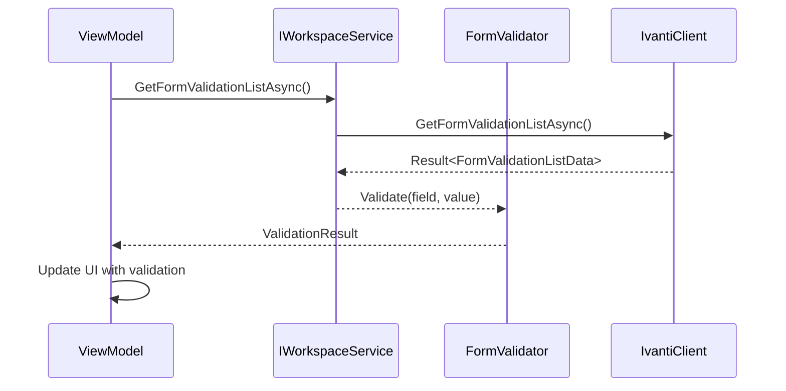

# XSC Ivanti Mobile App - Class Diagram

## Overview
This diagram shows the relationships between major classes in the Application layer of the XSC Ivanti Mobile App.

## Class Relationships Diagram

```mermaid
graph TB
    subgraph Common["Common Classes"]
        Result["Result&lt;T&gt;<br/>Status: bool<br/>Value: T<br/>Error: string"]
        PagedQuery["PagedQuery<br/>Page: int<br/>PageSize: int<br/>Search: string<br/>SortBy: string<br/>Filters: Dictionary"]
        PagedResult["PagedResult&lt;T&gt;<br/>Items: IReadOnlyList&lt;T&gt;<br/>Page: int<br/>PageSize: int<br/>TotalCount: int<br/>TotalPages: int"]
    end

    subgraph GridHandling["Grid Data Handling"]
        GridDataHandler["GridDataHandler<br/>TotalCount: int<br/>Skip: int<br/>Take: int<br/>Sort: string<br/>Filter: string"]
        GridDataHandlerRequest["GridDataHandlerRequest"]
        GridDataHandlerResponse["GridDataHandlerResponse<br/>D: FormViewData"]
    end

    subgraph WorkspaceModels["Workspace Models"]
        WorkspaceData["WorkspaceData<br/>ObjectId: string<br/>ObjectDisplay: string<br/>AllowDesign: bool<br/>SearchData: WorkspaceSearchData<br/>LayoutData: WorkspaceLayoutData"]
        WorkspaceSearchData["WorkspaceSearchData<br/>PreviewGridName: string<br/>RelatedObjects: List<br/>Favorites: List&lt;WorkspaceFavorite&gt;<br/>AllowFullTextSearch: bool<br/>CanCreate: bool"]
        RoleWorkspaces["RoleWorkspaces<br/>Workspaces: List&lt;Workspace&gt;<br/>RecentWorkspaces: List<br/>AllWorkspaces: List<br/>MobileWorkspaces: List<br/>Notifications: RoleWorkspaceNotifications<br/>BrandingOptions: RoleWorkspaceBrandingOptions"]
        Workspace["Workspace<br/>WorkspaceId: string<br/>WorkspaceName: string<br/>..."]
        RoleWorkspaceNotifications["RoleWorkspaceNotifications"]
        RoleWorkspaceBrandingOptions["RoleWorkspaceBrandingOptions"]
    end

    subgraph FormModels["Form Data Models"]
        FormViewData["FormViewData<br/>Type: string<br/>ViewName: string<br/>FormDef: FormDefinition"]
        FormDefinition["FormDefinition<br/>TableMeta: TableMeta<br/>FormMeta: FormMeta<br/>RuleMeta: RuleMeta<br/>LinkIdMap: Dictionary<br/>FieldValidationTableRights: Dictionary"]
        FormDefaultData["FormDefaultData<br/>FormDefaultDataContainer<br/>ObjectId: string<br/>Def: FormDefinition<br/>Data: FormDataModel"]
        FormValidationListData["FormValidationListData<br/>FieldName: string<br/>Values: List<br/>DisplayValues: List"]
        FormDataModel["FormDataModel"]
        TableMeta["TableMeta"]
        FormMeta["FormMeta"]
        RuleMeta["RuleMeta"]
    end

    subgraph IncidentModels["Incident Models"]
        IncidentDto["IncidentDto<br/>RecordId: string<br/>Subject: string<br/>Status: string<br/>Priority: string<br/>CreatedDate: DateTime"]
        IncidentListItemDto["IncidentListItemDto<br/>RecordId: string<br/>DisplayValue: string<br/>Status: string<br/>Priority: string<br/>Subject: string"]
    end

    subgraph DTOs["Request/Response DTOs"]
        GetWorkspaceDataRequest["GetWorkspaceDataRequest"]
        GetWorkspaceDataResponse["GetWorkspaceDataResponse<br/>WorkspaceData: WorkspaceData"]
        GetFormViewDataRequest["FindFormViewDataRequest"]
        GetFormViewDataResponse["FindFormViewDataResponse<br/>FormViewData: FormViewData"]
        GetFormDefaultDataRequest["GetFormDefaultDataRequest"]
        GetFormDefaultDataResponse["GetFormDefaultDataResponse<br/>FormDefaultData: FormDefaultData"]
        GetFormValidationListRequest["GetFormValidationListDataRequest"]
        GetFormValidationListResponse["GetFormValidationListDataResponse<br/>ValidationListData: FormValidationListData"]
    end

    subgraph AuthModels["Authentication Models"]
        VerificationToken["VerificationToken<br/>Token: string<br/>ExpiresAt: DateTime"]
        SessionData["SessionData<br/>SessionId: string<br/>UserId: string<br/>CreatedAt: DateTime"]
        UserData["UserData<br/>UserId: string<br/>Username: string<br/>Email: string"]
        AuthenticationResult["AuthenticationResult<br/>IsAuthenticated: bool<br/>UserId: string<br/>Message: string"]
    end

    %% Relationships
    GridDataHandlerResponse -->|contains| FormViewData
    GridDataHandler -->|uses for| PagedQuery
    PagedResult -->|uses| PagedQuery

    WorkspaceData -->|has| WorkspaceSearchData
    RoleWorkspaces -->|contains| Workspace
    RoleWorkspaces -->|has| RoleWorkspaceNotifications
    RoleWorkspaces -->|has| RoleWorkspaceBrandingOptions

    FormViewData -->|contains| FormDefinition
    FormDefinition -->|has| TableMeta
    FormDefinition -->|has| FormMeta
    FormDefinition -->|has| RuleMeta

    FormDefaultData -->|contains| FormDefinition
    FormDefaultData -->|contains| FormDataModel

    FormValidationListData -->|validates| FormViewData

    GetWorkspaceDataResponse -->|returns| WorkspaceData
    GetFormViewDataResponse -->|returns| FormViewData
    GetFormDefaultDataResponse -->|returns| FormDefaultData
    GetFormValidationListResponse -->|returns| FormValidationListData

    GetWorkspaceDataRequest -->|requests| WorkspaceData
    GetFormViewDataRequest -->|requests| FormViewData
    GetFormDefaultDataRequest -->|requests| FormDefaultData
    GetFormValidationListRequest -->|requests| FormValidationListData

    IncidentListItemDto -->|used in| PagedResult
    IncidentDto -->|extends| IncidentListItemDto

    %% Styling
    classDef common fill:#e1f5ff,stroke:#01579b,stroke-width:2px
    classDef gridHandler fill:#f3e5f5,stroke:#4a148c,stroke-width:2px
    classDef workspace fill:#e8f5e9,stroke:#1b5e20,stroke-width:2px
    classDef form fill:#fff3e0,stroke:#e65100,stroke-width:2px
    classDef incident fill:#fce4ec,stroke:#880e4f,stroke-width:2px
    classDef dto fill:#f1f8e9,stroke:#33691e,stroke-width:2px
    classDef auth fill:#ede7f6,stroke:#311b92,stroke-width:2px

    class Result,PagedQuery,PagedResult common
    class GridDataHandler,GridDataHandlerRequest,GridDataHandlerResponse gridHandler
    class WorkspaceData,WorkspaceSearchData,RoleWorkspaces,Workspace,RoleWorkspaceNotifications,RoleWorkspaceBrandingOptions workspace
    class FormViewData,FormDefinition,FormDefaultData,FormValidationListData,FormDataModel,TableMeta,FormMeta,RuleMeta form
    class IncidentDto,IncidentListItemDto incident
    class GetWorkspaceDataRequest,GetWorkspaceDataResponse,GetFormViewDataRequest,GetFormViewDataResponse,GetFormDefaultDataRequest,GetFormDefaultDataResponse,GetFormValidationListRequest,GetFormValidationListResponse dto
    class VerificationToken,SessionData,UserData,AuthenticationResult auth
```



## Architecture Layers



## Data Flow Example: Workspace Loading



## Data Flow Example: Form Validation



## Class Organization by Feature

### Workspace Feature
```
Application/
├── Features/Workspaces/
│   ├── Models/
│   │   ├── GridDataHandler/
│   │   │   └── GridDataHandler.cs
│   │   ├── FormViewData/
│   │   │   └── FormViewData.cs
│   │   ├── FormDefaultData/
│   │   │   └── FormDefaultData.cs
│   │   ├── FormValidationListData/
│   │   │   └── FormValidationListData.cs
│   │   ├── WorkspaceData/
│   │   │   └── WorkspaceData.cs
│   │   ├── ValidatedSearch/
│   │   │   └── ValidatedSearch.cs
│   │   └── RoleWorkspaces/
│   │       ├── RoleWorkspaces.cs
│   │       ├── Workspace.cs
│   │       ├── RoleWorkspaceNotifications.cs
│   │       ├── RoleWorkspaceBrandingOptions.cs
│   │       ├── RoleWorkspaceSelectorOptions.cs
│   │       └── RoleWorkspaceSystemMenuOptions.cs
│   └── DTOs/
│       ├── GetWorkspaceDataRequest.cs
│       ├── GetWorkspaceDataResponse.cs
│       ├── FindFormViewDataRequest.cs
│       ├── FindFormViewDataResponse.cs
│       ├── GetFormDefaultDataRequest.cs
│       ├── GetFormDefaultDataResponse.cs
│       ├── GetFormValidationListDataRequest.cs
│       ├── GetFormValidationListDataResponse.cs
│       ├── GridDataHandlerRequest.cs
│       ├── GridDataHandlerResponse.cs
│       ├── GetRoleWorkspacesRequest.cs
│       ├── GetRoleWorkspacesResponse.cs
│       ├── GetValideatedSearchRequest.cs
│       └── GetValideatedSearchResponse.cs
```

### Incident Feature
```
Application/
├── Features/Incidents/
│   └── DTOs/
│       ├── IncidentDto.cs
│       ├── IncidentListItemDto.cs
│       └── IncidentUpdateRequestDto.cs
```

### Common Classes
```
Application/
├── Common/
│   ├── Result.cs
│   ├── PagedResult.cs
│   ├── PagedQuery.cs
│   └── Models/
│       ├── UserData/
│       ├── SessionData/
│       └── ...
```

## Key Relationships Summary

| From | To | Relationship | Purpose |
|------|----|--------------|-----------:|
| `GridDataHandlerResponse` | `FormViewData` | Contains | Wraps form view data in API response |
| `FormViewData` | `FormDefinition` | Contains | Contains form structure and metadata |
| `FormDefinition` | `TableMeta`, `FormMeta`, `RuleMeta` | Composed of | Defines form behavior |
| `FormDefaultData` | `FormDefinition` | Uses | References definition for new form instances |
| `RoleWorkspaces` | `Workspace` | Contains | Lists available workspaces |
| `WorkspaceData` | `WorkspaceSearchData` | Has | Defines search capabilities |
| `PagedResult<T>` | Generic Type | Parameterized | Provides pagination for any list type |
| `Result<T>` | Generic Type | Parameterized | Wraps operation results with error handling |

## Design Patterns Used

1. **DTO Pattern**: Transfer objects between layers
   - `GetWorkspaceDataRequest/Response`
   - `FindFormViewDataRequest/Response`

2. **Generic Result Pattern**: Consistent error handling
   - `Result<T>` for operation results
   - `PagedResult<T>` for paginated data

3. **Composition Pattern**: Complex objects composed of simpler ones
   - `FormViewData` contains `FormDefinition`
   - `FormDefinition` contains `TableMeta`, `FormMeta`, `RuleMeta`
   - `RoleWorkspaces` contains list of `Workspace`

4. **Builder/Container Pattern**: Aggregate root pattern
   - `GridDataHandlerResponse` wraps `FormViewData`
   - `FormDefaultData` aggregates form data and definition

5. **Nested Classes**: Logical grouping
   - `FormDefaultData.FormDefaultDataContainer`
   - `WorkspaceData.WorkspaceSearchData`
